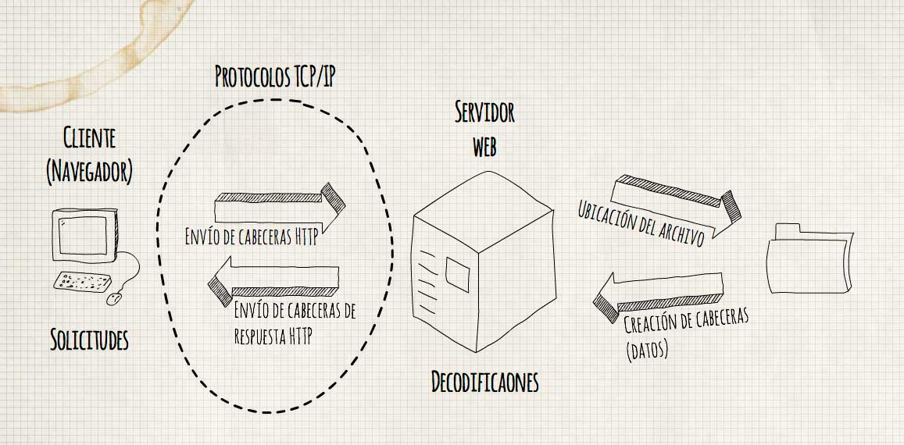

### UNIVERSIDAD PÚBLICA DE EL ALTO
### Carrera: INGENIERÍA DE SISTEMAS
### Estudiante: "Miriam Paola Velasco Mamani"
### CI: 8264174 L.P.
### Fecha: "13/8/2019"

### **TECNOLOGÍAS EMERGENTES II**

**PRACTICA NRO. 1**
-------------------

**SISTEMAS EMPRESARIALES**
--------------------------

### *1) Explique que son los sistemas empresariales:*

-   Un Sistema de Información Empresarial es un sistema que tiene un
    impacto muy importante en el funcionamiento de la organización o
    negocio y cuya falla traería graves consecuencias.

-   Normalmente que ofrece alta calidad de servicio, gestiona con
    grandes volúmenes de datos, disponible de forma continua y es capaz
    de soportar cualquier organización grande.

### *2) Describa cuales son las características más importantes de una aplicación empresarial*

-   Acceso a **bases de datos**, usualmente a bases de datos
    relacionales.
-   Operaciones **transaccionales**, cumple con las propiedades ACID.
-   **Escalables**, permiten escalabilidad vertical y horizontal.
-   **Disponibles**, idealmente prestan servicios de forma continua.
-   **Seguras**, no todos los usuarios acceden con la misma
    funcionalidad.
-   Permiten **integración** con otras tecnologías.
-   Arquitectura **multicapa**.

### *3) Investigue y proponga cinco instituciones que requerirían aplicaciones de misión crítica.*

*Justifique su respuesta*

**A) FELCC**

La División Trata y Tráfico de Personas tiene por función general el de desarrollar y coordinar acciones que compartan el interés común de labores investigativas en respuesta contra el Tráfico de Seres Humanos asignando el respeto por los derechos y la dignidad del ser Humano.
Requiere una aplicación que sea de fácil acceso para poder identificar y buscar información sobre las personas desaparecidas, los cuales al solo ser archivadas en papel suelen perderse. Y la búsqueda no se continua, más queda en el olvido.

**B) LA POLICIA NACIONAL**

La Policía Boliviana que lideriza la seguridad ciudadana, coadyuvando con el desarrollo para el vivir bien; necesita una aplicación que permita la rápida contestación para los que en verdad necesitan ayuda, es decir una rápida respuesta ante peligros que un ser humano pueda tener, ya que cuando uno llama, la respuesta es lenta, más de dos horas, incluso más, para que no suceda eso, una aplicación podría dar rápida ubicación y respuesta ante hechos delictivos.

**C) MISIONERAS SALESIANAS DEL SAGRADO CORAZÓN DE JESÚS**

Es una cálida institución de hermanas que colaboran con los niños de diferentes comunidades, se encuentra en La Paz, Cochabamba, Santa Cruz y Chuquisaca, es necesario una aplicación para poder realizar un inventario de las donadas, para una buena organización y ser distribuidas adecuadamente según la necesidad de las comunidades.

**D) UNIDAD EDUCATIVA PRIVADA SAGRADO CORAZÓN DE JESÚS**

Es un colegio privado que necesita una aplicación critica, debido al sistema que tienen en Visual Basic, es muy lento, con muchos errores, del cual dependen para poder hacer consultas para informes estadísticos y de notas. Así como una amplia conexión al sistema web, para una mejor colaboración de padres y la institución.

**E) ESTUDIO JURÍDICO SÁNCHEZ & ASOCIADOS**

Es necesario una aplicación que pueda ser de rápida contestación para el cliente, además de archivos que quedan en papel, pueden ser vistos de forma que ya estén en el sistema y el mismo cliente pueda tener seguimiento de su caso.

### *4) Explique cuáles son las diferencias entre la escalabilidad horizontal y escalabilidad vertical*

**Escalabilidad vertical**

La escalabilidad vertical o hacia arriba, este es el más simple, pues
significa crecer el hardware de uno de los nodos, es decir aumentar el
hardware por uno más potente, como disco duro, memoria, procesador, etc.
pero también puede ser la migración completa del hardware por uno más
potente. El esfuerzo de este crecimiento es mínimo, pues no tiene
repercusiones en el software, ya que solo será respaldar y migrar los
sistemas al nuevo hardware.

**Escalabilidad horizontal**

El escalamiento horizontal es sin duda el más potente, pero también el
más complicado. Este modelo implica tener varios servidores (conocidos
como Nodos) trabajando como un todo. Se crea una red de servidores
conocida como Cluster, con la finalidad de repartirse el trabajo entre
todos nodos del cluster, cuando el performance del cluster se ve
afectada con el incremento de usuarios, se añaden nuevos nodos al
cluster, de esta forma a medida que es requeridos, más y más nodos son
agregados al cluster.

La diferencia es que en la **Escalabilidad vertical**:

-   No implica un gran problema para las aplicaciones, pues todo el
    cambio es sobre el hardware.
-   Es mucho más fácil de implementar que el escalamiento horizontal.
-   Puede ser una solución rápida y económica (compara con modificar el
    software).

Mientrás que la **Escalabilidad horizontal**:

-   El crecimiento es prácticamente infinito, podríamos agregar cuantos
    servidores sean necesarios.
-   Es posible combinarse con el escalamiento vertical.
-   Soporta la alta disponibilidad.
-   Si un nodo falla, los demás sigue trabajando.
-   Soporta el balanceo de cargas.

### *5) Que es un servidor Web y que es un servidor de aplicaciones*

### **Servidor web**

Un servidor web o servidor HTTP es un programa informático que procesa
una aplicación del lado del servidor realizando conexiones
bidireccionales y/o unidireccionales y síncronas o asíncronas con el
cliente generando o cediendo una respuesta en cualquier lenguaje o
Aplicación del lado del cliente. El código recibido por el cliente suele
ser compilado y ejecutado por un navegador web. Para la transmisión de
todos estos datos suele utilizarse algún protocolo. Generalmente se
utiliza el protocolo HTTP para estas comunicaciones, perteneciente a la
capa de aplicación del modelo OSI. El término también se emplea para
referirse al ordenador que ejecuta el programa.

**Funcionamiento :**

El Servidor web se ejecuta en un ordenador manteniéndose a la espera de
peticiones por parte de un cliente (un navegador web) y que responde a
estas peticiones adecuadamente, mediante una página web que se exhibirá
en el navegador o mostrando el respectivo mensaje si se detectó algún
error.

Además de la transferencia de código HTML, los Servidores web pueden
entregar aplicaciones web. Éstas son porciones de código que se ejecutan
cuando se realizan ciertas peticiones o respuestas HTTP. Hay que
distinguir entre:

-   Aplicaciones en el lado del cliente: el cliente web es el encargado
    de ejecutarlas en la máquina del usuario. Son las aplicaciones tipo
    Java "applets" o Javascript: el servidor proporciona el código de
    las aplicaciones al cliente y éste, mediante el navegador, las
    ejecuta. Es necesario, por tanto, que el cliente disponga de un
    navegador con capacidad para ejecutar aplicaciones (también llamadas
    scripts). Comúnmente, los navegadores permiten ejecutar aplicaciones
    escritas en lenguaje javascript y java, aunque pueden añadirse más
    lenguajes mediante el uso de plugins.

-   Aplicaciones en el lado del servidor: el servidor web ejecuta la
    aplicación; ésta, una vez ejecutada, genera cierto código HTML; el
    servidor toma este código recién creado y lo envía al cliente por
    medio del protocolo HTTP.

Las aplicaciones de servidor muchas veces suelen ser la mejor opción
para realizar aplicaciones web. La razón es que, al ejecutarse ésta en
el servidor y no en la máquina del cliente, éste no necesita ninguna
capacidad añadida, como sí ocurre en el caso de querer ejecutar
aplicaciones javascript o java. Así pues, cualquier cliente dotado de un
navegador web básico puede utilizar este tipo de aplicaciones. El hecho
de que HTTP y HTML estén íntimamente ligados no debe dar lugar a
confundir ambos términos. HTML es un lenguaje de marcas y HTTP es un
"protocolo".

Algunos servidores web importantes son:

-   Apache
-   Tomcat
-   Cherokee

### **Servidor de aplicaciones**

En informática, se denomina servidor de aplicaciones a un servidor en
una red de computadores que ejecuta ciertas aplicaciones. Usualmente se
trata de un dispositivo de software que proporciona servicios de
aplicación a las computadoras cliente. Un servidor de aplicaciones
generalmente gestiona la mayor parte (o la totalidad) de las funciones
de lógica de negocio y de acceso a los datos de la aplicación. Los
principales beneficios de la aplicación de la tecnología de servidores
de aplicación son la centralización y la disminución de la complejidad
en el desarrollo de aplicaciones.

**Servidores de aplicaciones Java EE**

Como consecuencia del éxito del lenguaje de programación Java, el
término servidor de aplicaciones usualmente hace referencia a un
servidor de aplicaciones Java EE. Entre los servidores de aplicación
Java EE privativos más conocidos se encuentran WebLogic de Oracle (antes
BEA Systems) y WebSphere de IBM. EAServer de Sybase Inc. es también
conocido por ofrecer soporte a otros lenguajes diferentes a Java, como
PowerBuilder. Entre los servidores de aplicaciones libres se encuentran
JOnAS del consorcio ObjectWeb, JBoss AS de JBoss (división de Red Hat),
Geronimo de Apache, TomEE de Apache, Resin Java Application Server de
Caucho Technology, Blazix de Desiderata Software, Enhydra Server de
Enhydra.org y GlassFish de Oracle. Mucha gente confunde Tomcat como un
servidor de aplicaciones; sin embargo, es solamente un contenedor de
servlets.

Java EE provee estándares que permiten a un servidor de aplicaciones
servir como "contenedor" de los componentes que conforman dichas
aplicaciones. Estos componentes, escritos en lenguaje Java, usualmente
se conocen como Servlets, Java Server Pages (JSPs) y Enterprise
JavaBeans (EJBs) y permiten implementar diferentes capas de la
aplicación, como la interfaz de usuario, la lógica de negocio, la
gestión de sesiones de usuario o el acceso a bases de datos remotas.

La portabilidad de Java también ha permitido que los servidores de
aplicación Java EE se encuentren disponibles sobre una gran variedad de
plataformas, como Unix, Microsoft Windowsy GNU/Linux.

### *6) Con un gráfico explique cómo funciona el protocolo HTTP*

Otra explicación gráfica:

### *7) Explique los elementos importantes de REQUEST en HTTP*

HTTP define un conjunto de métodos de petición para indicar la acción
que se desea realizar para un recurso determinado. Aunque estos también
pueden ser sustantivos, estos métodos de solicitud a veces son llamados
HTTP verbs. Cada uno de ellos implementan una semántica diferente, pero
algunas características similares son compartidas por un grupo de ellos:
ej. un request method puede ser safe, idempotent, o cacheable.

**GET** El método GET solicita una representación de un recurso
específico. Las peticiones que usan el método GET sólo deben recuperar
datos.

**HEAD** El método HEAD pide una respuesta idéntica a la de una petición
GET, pero sin el cuerpo de la respuesta.

**POST** El método POST se utiliza para enviar una entidad a un recurso
en específico, causando a menudo un cambio en el estado o efectos
secundarios en el servidor.

**PUT**

    El modo PUT reemplaza todas las representaciones actuales del recurso de destino con la carga útil de la petición.

**DELETE**

    El método DELETE borra un recurso en específico.

**CONNECT**

    El método CONNECT establece un túnel hacia el servidor identificado por el recurso.

**OPTIONS**

    El método OPTIONS es utilizado para describir las opciones de comunicación para el recurso de destino.

**TRACE**

    El método TRACE  realiza una prueba de bucle de retorno de mensaje a lo largo de la ruta al recurso de destino.

**PATCH**

    El método PATCH  es utilizado para aplicar modificaciones parciales a un recurso. 

### *8) Explique los elementos importantes de RESPONSE en HTTP*

Los códigos de estado de respuesta HTTP indican si se ha completado
satisfactoriamente una solicitud HTTP específica. Las respuestas se
agrupan en cinco clases: respuestas informativas, respuestas
satisfactorias, redirecciones, errores de los clientes y errores de los
servidores.

**Respuestas informativas**

**100 Continue**

    Esta respuesta provisional indica que todo hasta ahora está bien y que el cliente debe continuar con la solicitud o ignorarla si ya está terminada.

**101 Switching Protocol**

    Este código se envía en respuesta a un encabezado de solicitud Upgrade por el cliente e indica que el servidor acepta el cambio de protocolo propuesto por el agente de usuario.

**102 Processing (WebDAV)**

    Este código indica que el servidor ha recibido la solicitud y aún se encuentra procesandola, por lo que no hay respuesta disponible.

**Respuestas satisfactorias**

**200 OK**

    La solicitud ha tenido éxito. El significado de un éxito varía dependiendo del método HTTP:
    **GET:** El recurso se ha obtenido y se transmite en el cuerpo del mensaje.
    **HEAD:** Los encabezados de entidad están en el cuerpo del mensaje.
    **PUT o POST:** El recurso que describe el resultado de la acción se transmite en el cuerpo del mensaje.
    **TRACE:** El cuerpo del mensaje contiene el mensaje de solicitud recibido por el servidor.

**201 Created**

    La solicitud ha tenido éxito y se ha creado un nuevo recurso como resultado de ello. Ésta es típicamente la respuesta enviada después de una petición PUT.

**202 Accepted**

    La solicitud se ha recibido, pero aún no se ha actuado. Es una petición "Sin compromiso", lo que significa que no hay manera en HTTP que permita enviar una respuesta asíncrona que indique el resultado del procesamiento de la solicitud. Está pensado para los casos en que otro proceso o servidor maneja la solicitud, o para el procesamiento por lotes.

**203 Non-Authoritative Information**

    La petición se ha completado con éxito, pero su contenido no se ha obtenido de la fuente originalmente solicitada, sino que se recoge de una copia local o de un tercero. Excepto esta condición, se debe preferir una respuesta de 200 OK en lugar de esta respuesta.

**204 No Content**

    La petición se ha completado con éxito pero su respuesta no tiene ningún contenido, aunque los encabezados pueden ser útiles. El agente de usuario puede actualizar sus encabezados en caché para este recurso con los nuevos valores.

**205 Reset Content**

    La petición se ha completado con éxito, pero su respuesta no tiene contenidos y además, el agente de usuario tiene que inicializar la página desde la que se realizó la petición, este código es útil por ejemplo para páginas con formularios cuyo contenido debe borrarse después de que el usuario lo envíe.

**206 Partial Content**

    La petición servirá parcialmente el contenido solicitado. Esta característica es utilizada por herramientas de descarga como wget para continuar la transferencia de descargas anteriormente interrumpidas, o para dividir una descarga y procesar las partes simultáneamente.

**207 Multi-Status (WebDAV)**

    Una respuesta Multi-Estado transmite información sobre varios recursos en situaciones en las que varios códigos de estado podrían ser apropiados. El cuerpo de la petición es un mensaje XML.

**208 Multi-Status (WebDAV)**

    El listado de elementos DAV ya se notificó previamente, por lo que no se van a volver a listar.

**226 IM Used (HTTP Delta encoding)**

    El servidor ha cumplido una petición GET para el recurso y la respuesta es una representación del resultado de una o más manipulaciones de instancia aplicadas a la instancia actual.

**Redirecciones**

**300 Multiple Choice**

    Esta solicitud tiene más de una posible respuesta. User-Agent o el usuario debe escoger uno de ellos. No hay forma estandarizado de seleccionar una de las respuestas.

**301 Moved Permanently**

    Este código de respuesta significa que la URI  del recurso solicitado ha sido cambiado. Probablemente una nueva URI sea devuelta en la respuesta.

**302 Found**

    Este código de respuesta significa que el recurso de la URI solicitada ha sido cambiado temporalmente. Nuevos cambios en la URI serán agregados en el futuro. Por lo tanto, la misma URI debe ser usada por el cliente en futuras solicitudes.
     

**303 See Other**

    El servidor envia esta respuesta para dirigir al cliente a un nuevo recurso solcitado a otra dirección usando una petición GET.

**304 Not Modified**

    Esta es usada para propositos de "caché". Le indica al cliente que la respuesta no ha sido modificada. Entonces, el cliente puede continuar usando la misma versión almacenada en su caché.

**305 Use Proxy**

    Fue definida en una versión previa de la especificación del protocolo HTTP para indicar que una respuesta solicitada debe ser accedida desde un proxy. Ha quedado obsoleta debido a preocupaciones de seguridad correspondientes a la configuración de un proxy.

**306 unused**

    Este código de respuesta ya no es usado más. Actualmente se encuentra reservado. Fue usado en previas versiones de la especificación HTTP1.1.

**307 Temporary Redirect**

    El servidor envía esta respuesta para dirigir al cliente a obtener el recurso solicitado a otra URI con el mismo metodo que se uso la petición anterior. Tiene la misma semántica que el código de respuesta HTTP 302 Found, con la excepción de que el agente usuario no debe cambiar el método HTTP usado: si un POST fue usado en la primera petición, otro POST debe ser usado en la segunda petición.

**308 Permanent Redirect**

    Significa que el recurso ahora se encuentra permanentemente en otra URI, especificada por la respuesta de encabezado HTTP Location:. Tiene la misma semántica que el código de respuesta HTTP 301 Moved Permanently, con la excepción de que el agente usuario no debe cambiar el método HTTP usado: si un POST fue usado en la primera petición, otro POST debe ser usado en la segunda petición.

**Errores de cliente**

**400 Bad Request**

    Esta respuesta significa que el servidor no pudo interpretar la solicitud dada una sintaxis inválida.

**401 Unauthorized**

    Es necesario autenticar para obtener la respuesta solicitada. Esta es similar a 403, pero en este caso, autenticación es posible.

**402 Payment Required**

    Este código de respuesta está reservado para futuros usos. El objetivo inicial de crear este código fue para ser utilizado en sistemas digitales de pagos. Sin embargo, no está siendo usado actualmente.

**403 Forbidden**

    El cliente no posee los permisos necesarios para cierto contenido, por lo que el servidor está rechazando otorgar una respuesta apropiada.

**404 Not Found**

    El servidor no pudo encontrar el contenido solicitado. Este código de respuesta es uno de los más famosos dada su alta ocurrencia en la web.

**405 Method Not Allowed**

    El método solicitado es conocido por el servidor pero ha sido deshabilitado y no puede ser utilizado. Los dos métodos obligatorios, GET y HEAD, nunca deben ser deshabilitados y no debiesen retornar este código de error.

**406 Not Acceptable**

    Esta respuesta es enviada cuando el servidor, despues de aplicar una negociación de contenido servidor-impulsado, no encuentra ningún contenido seguido por la criteria dada por el usuario.

**407 Proxy Authentication Required**

    Esto es similar al código 401, pero la autenticación debe estar hecha a partir de un proxy.

**408 Request Timeout**

    Esta respuesta es enviada en una conexión inactiva en algunos servidores, incluso sin alguna petición previa por el cliente. Significa que el servidor quiere desconectar esta conexión sin usar. Esta respuesta es muy usada desde algunos navegadores, como Chrome, Firefox 27+, o IE9, usa mecanismos de pre-conexión HTTP para acelerar la navegación. También hay que tener cuenta que algunos servidores simplemente desconectan la conexión sin enviar este mensaje.

**409 Conflict**

    Esta respuesta puede ser enviada cuando una petición tiene conflicto con el estado actual del servidor.

**410 Gone**

    Esta respuesta puede ser enviada cuando el contenido solicitado ha sido borrado del servidor.

**411 Length Required**

    El servidor rechaza la petición porque el campo de encabezado Content-Length no esta definido y el servidor lo requiere.

**412 Precondition Failed**

    El cliente ha indicado pre-condiciones en sus encabezados la cual el servidor no cumple.

**413 Payload Too Large**

    La entidad de petición es más larga que los limites definidos por el servidor; el servidor puede cerrar la conexión o retornar un campo de encabezado Retry-After.

**414 URI Too Long**

    La URI solicitada por el cliente es más larga que el servidor está dispuesto a interpretar.

**415 Unsupported Media Type**

    El formato multimedia de los datos solicitados no está soportada por el servidor, por lo cual el servidor rechaza la solicitud.

**416 Requested Range Not Satisfiable**

    El rango especificado por el campo de encabezado Range en la solicitud no cumple; es posible que el rango está fuera del tamaño de los datos objetivo del URI.

**417 Expectation Failed**

    Significa que la expectativa indicada por el campo de encabezado Expect solicitada no puede ser cumplida por el servidor.

**418 I'm a teapot**

    El servidor se reúsa a intentar hacer café con una tetera.

**421 Misdirected Request**

    La petición fue dirigida a un servidor que no es capaz de producir una respuesta. Esto puede ser enviado por un servidor que no esta configurado para producir respuestas por la combinación del esquema y la autoridad que estan incluidos en la URI solicitada

**422 Unprocessable Entity (WebDAV)**

    La petición estaba bien formada pero no se pudo seguir debido a errores de semántica.

**423 Locked (WebDAV)**

    El recurso que está siendo accedido está bloqueado.

**424 Failed Dependency (WebDAV)**

    La petición falló debido a una falla de una petición previa.

**426 Upgrade Required**

    El servidor se reúsa a aplicar la solicitud usando el protocolo actual pero puede estar dispuesto a hacerlo después que el cliente se actualize a un protocolo diferente. El servidor envía un encabezado Upgrade en una respuesta para indicar los protocolos requeridos.

**428 Precondition Required**

    El servidor origen requiere que la solicitud sea condicional. Tiene la intención de prevenir problemas de 'actualización perdida', donde un cliente OBTIENE un estado del recurso, lo modifica, y lo PONE devuelta al servidor, cuando mientras un tercero ha modificado el estado del servidor, llevando a un conflicto.

**429 Too Many Requests**

    El usuario ha enviado demasiadas solicitudes en un periodo de tiempo dado.

**431 Request Header Fields Too Large**

    El servidor no está dispuesto a procesar la solicitud porque los campos de encabezado son demasiado largos. La solicitud PUEDE volver a subirse después de reducir el tamaño de los campos de encabezado solicitados.

**451 Unavailable For Legal Reasons**

    El usuario solicita un recurso ilegal, como alguna página web censurada por algún gobierno.

**Errores de servidor**

**500 Internal Server Error**

    El servidor ha encontrado una situación que no sabe como manejarla.

**501 Not Implemented**

    El método solicitado no esta soportado por el servidor y no puede ser manejada. Los unicos métodos que los servidores requieren soporte (y por lo tanto no deben retornar este código) son GET y HEAD.

**502 Bad Gateway**

    Esta respuesta de error significa que el servidor, mientras trabaja como una puerta de enlace para obtener una respuesta necesaria para manejar la petición, obtuvo una respuesta inválida.

**503 Service Unavailable**

    El servidor no esta listo para manejar la petición. Causas comunes puede ser que el servidor está caido por mantenimiento o está sobrecargado. Hay que tomar en cuenta que junto con esta respuesta, una página usuario-amigable explicando el problema debe ser enviada. Estas respuestas deben ser usadas para condiciones temporales y el encabezado HTTP Retry-After: debería, si es posible, contener el tiempo estimado antes de la recuperación del servicio. El webmaster debe también cuidar los encabezados relacionados al caché que son enviados junto a esta respuesta, ya que estas respuestas de condicion temporal deben usualmente no estar en el caché.

**504 Gateway Timeout**

    Esta respuesta de error es dada cuando el servidor está actuando como una puerta de enlace y no puede obtener una respuesta a tiempo.

**505 HTTP Version Not Supported**

    La versión de HTTP usada en la petición no está soportada por el servidor.

**506 Variant Also Negotiates**

    El servidor tiene un error de configuración interna: negociación de contenido transparente para la petición resulta en una referencia circular.

**507 Insufficient Storage**

    El servidor tiene un error de configuración interna: la variable de recurso escogida esta configurada para acoplar la negociación de contenido transparente misma, y no es por lo tanto un punto final adecuado para el proceso de negociación.

**508 Loop Detected (WebDAV)**

    El servidor detectó un ciclo infinito mientras procesaba la solicitud.

**510 Not Extended**

    Extensiones adicionales para la solicitud son requeridas para que el servidor las cumpla.

**511 Network Authentication Required**

    El código de estado 511 indica que el cliente necesita auntenticar para ganar acceso a la red.

### *9) Describa con un gráfico la arquitectura Java EE*

### *10) Explique cuáles son los contenedores, componentes y servicios de Java EE*

**Contendedores Java EE**

Un contenedor es un entorno de ejecución que provee al componente una serie de servicios.
Java EE define los siguientes tipos de contenedores:

+ Contenedor web
+ Contenedor de negocio (o de EJBs)

**Componentes Java EE**

Un componente es una unidad de software que forma parte de una aplicación.
Java EE define los siguientes tipos de componentes:

+ Componente cliente: Cliente AWT, Swing, Applet y navegador Web.
+ Componente web: Servlet, JSP y JSF.
+ Componente de negocio: EJB.

Cada tipo cubre necesidades concretas y se basan en APIs especificas.

**Servicios Java EE**

Son los servicios que deben ofrecer los contenedores Java EE.
Java EE define los siguientes servicios:

+ De directorio: para la indexación y búsqueda de componentes y recursos.
+ De despliegue: para poder personalizar los componentes y recursos.
+ De transaccionalidad: para poder ejecutar distintas acciones en una misma unidad transaccional.
+ De seguridad: para poder autenticar y autorizar a los usuarios de la aplicación.
+ De acceso a datos: para facilitar el acceso a Bases de Datos.
+ De conectividad: para poder acceder fácilmente a distintos EIS.
+ De mensajería: para poder comunicarse con otros componentes, aplicaciones o EIS.

Para que un entorno de ejecución pueda decir que es Java EE debe implementar y soportar:

+ Todos los tipos de componentes
+ Todos los tipos de contenedores
+ Todos los servicios+ 
